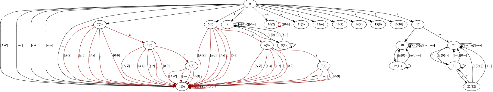

# Enum Lexer

[](https://crates.io/crates/enum-lexer)
[](https://docs.rs/enum-lexer)

A proc_macro lexer generator. using `enum`-like syntax.

## Write a lexer

Nightly feature exclusive_range_pattern is required for generated code. 


```rust
#![feature(exclusive_range_pattern)]
use enum_lexer::enum_lexer;

enum_lexer! {
    #[derive(Debug, Eq, PartialEq)]
    enum lexer {
        Ident(String): {
            r"[A-Za-z_][A-Za-z_0-9]*" => Ident(text),
        }
        LitInt(usize): {
            r"[0-9][0-9]*" =>
                LitInt(text.parse::<usize>()?), // default error type is Box<dyn Error>
        }
        Op(char): {
            r"\+" => Op('+'),
            r"\-" => Op('-'),
        }
        Def: r"def",
        Let: r"let",
        Group(Vec<Token>, char) : {
            r"\(" => {
                Group(read_group()?, '(')       // construct a token tree within '(', ')'.
            }
            r"\)" => { panic!("error") }
        }
        COMMENTS: {                             // COMMENTS will be ignored
            r"//.*?\n" => !,
            r"/\*.*?\*/" => !,
        }
    }
}
```

This will generate struct and enum like:

```rust
mod lexer {
     #[derive(Debug, Eq, PartialEq)]
     pub struct Token {
         pub inner: TokenInner,
         pub span: Span,
     }
     
     #[derive(Debug, Eq, PartialEq)]
     pub enum TokenInner {
         Ident(String),
         LitInt(usize),
         Op(char),
         Def,
         Let,
         Group(Vec<Token>, char),
     }
     pub struct TokenIterator{...}
     pub type LexError = Box<&dyn Error>;
     pub fn parse_str(src: &str) -> Result<TokenIterator>;
}
```

## Usage

`parse_str` will parse a string into a `TokenIterator`, which implemented `Iterator<Item=Result<lexer::Token>>` trait.

```rust
let vec: lexer::Result<Vec<_>> =
    lexer::parse_str(r#"
        let a = 10 + (1 + 2) // alpha
    "#).unwrap().collect();

println!("{:?}", vec);
```

## Customizing Error Types

```rust
enum_lexer! {
    type LexError = MyError;
    enum lexer {
        LitStr: "\".*?\""
    }
}
```

## Dfa Generation

`enum_lexer_test` will write generated DFA to a `dfa.dot` file.

